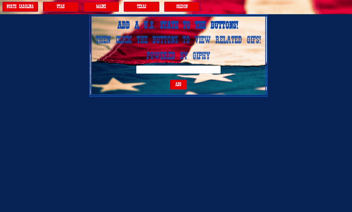

# GifMania
GifMania is an application that utilizes the Giphy API to pull the top 10 results based on a keyword of the user's choice. The theme is U.S. Countries.

## See it in action.
The application has several functions. First, when the page loads, the user can click on one of the pre-populated buttons along the top of the page. The first 10 results from the Giphy API will appear. THe user can click on each gif to make it play and click it a second time to stop it. 

The user can also add his/her own buttons by typing into the input box. Once the button is populated, it will function just like any other button. 

## Built With
JavaScript, JQuery, AJAX, Bootstrap

## Authors
Seton Raynor
